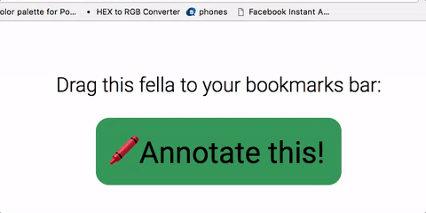
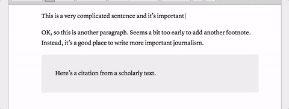
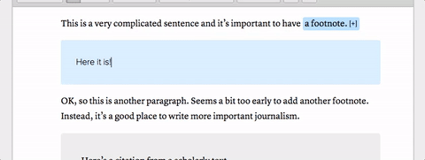
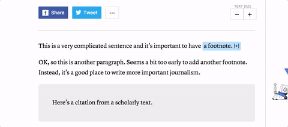

# The Atlantic's annotation bookmarklet hack
We think adding annotations to Atlantic stories would be neat. But before we implement them in our CMS, we want to make sure our readers and our reporters agree.

## How to use it

### Grab the bookmarklet
Head over to [this page](https://s3.amazonaws.com/the-atlantic/annotations/bookmarklet.html) and drag the bookmarklet to your toolbar.

###Select the text
Select the text you want to annotate in Ollie, and click the bookmarklet. It'll drop in an annotation box, where you can write to your heart's content!

You can even create an annotation _within_ an annotation — though you should only seriously consider this if you're David Foster Wallace.

###Publish
When you save your story, the annotation will come along.

###Let Andrew know!
Drop me a line when you've published a story with annotations. We want to keep track of them so we can install a permanent solution later, if these things catch on.

Here are the stories we've annotated so far:
* [A Behavioral Economist Tries to Fix Email,](https://www.theatlantic.com/business/archive/2017/03/economist-email-less-painful/518934/) by Joe Pinsker
* [The Transparency Bills That Would Gut the EPA,](https://www.theatlantic.com/science/archive/2017/03/how-to-gut-the-epa-in-the-name-of-honesty/519462/) by Ed Yong
* [How to Kill a Snake When You're a Snake,](https://www.theatlantic.com/science/archive/2017/03/snake-vs-snake/519696/) by Ed Yong
* [The GOP’s New Bill Is A Disaster For Genetics Research,](https://www.theatlantic.com/science/archive/2017/03/the-gops-new-bill-is-a-disaster-for-genetics-research/519645/) by Ed Yong
* [Trump's Budget Plan in 17 Charts - The Atlantic, ](https://www.theatlantic.com/politics/archive/2017/03/the-concrete-cost-of-trump-military-budget/518193/) by Andrew McGill
